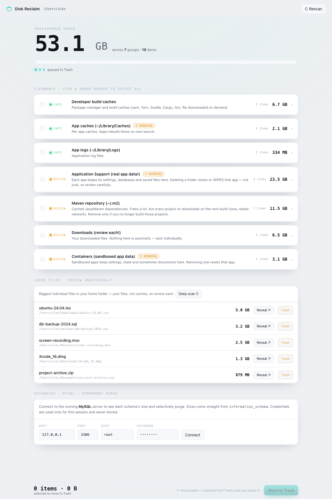
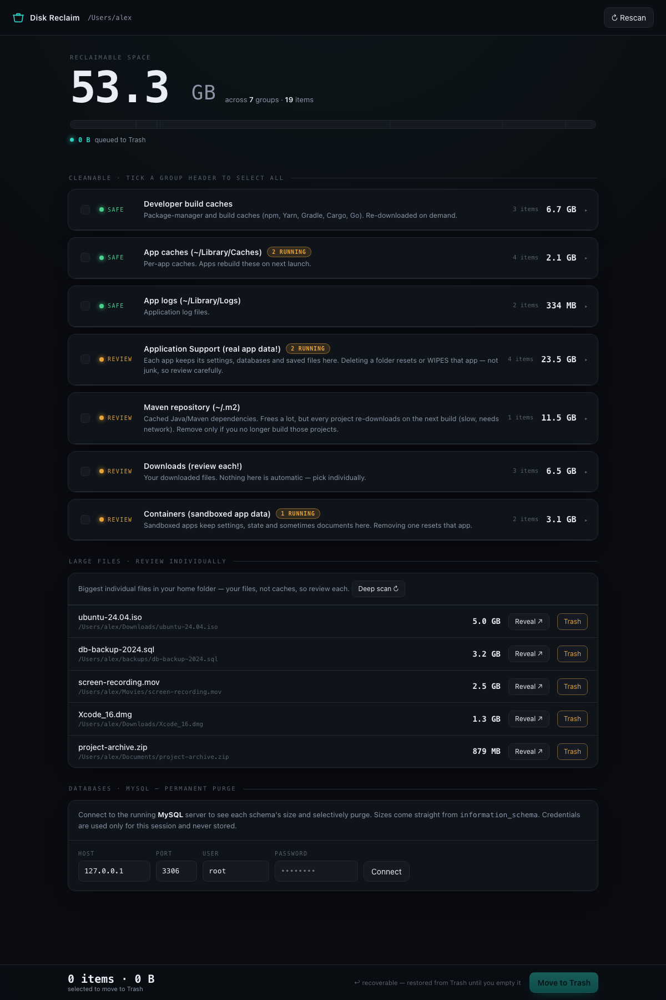
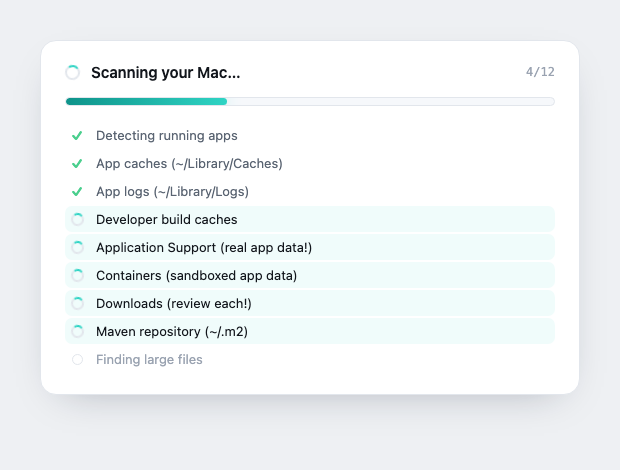
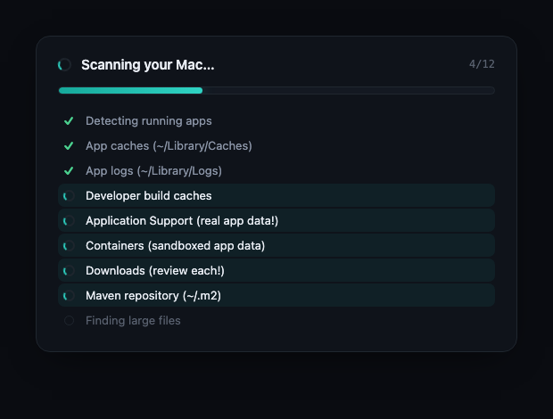
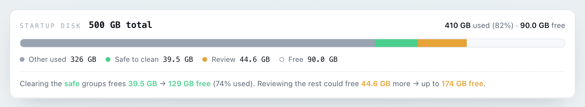
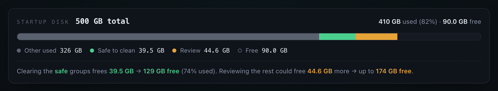
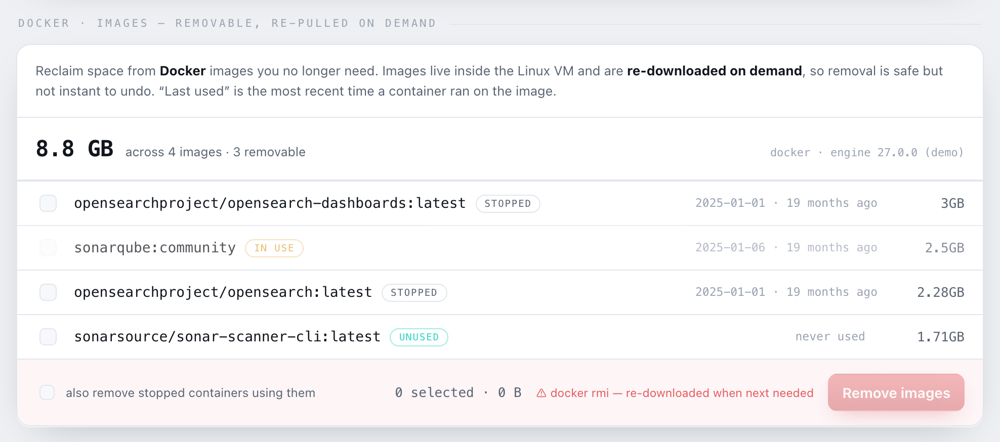
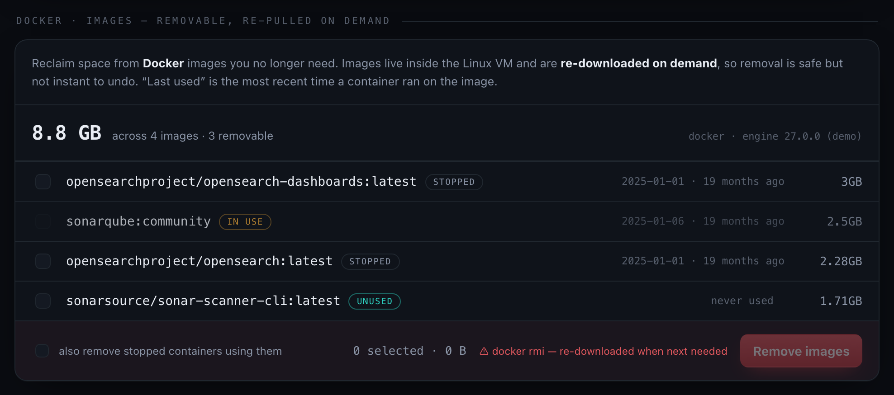

# 🧹 Disk Reclaim (`mac-cleaner`)

A tiny **local** web app that scans the usual macOS temp / cache / junk locations,
tells you which ones belong to apps that are currently running, and lets you
**selectively** clean them from your browser — plus a whole-disk **storage
overview**, **MySQL** schema inspection, and **Docker** image cleanup, all by size.

It runs entirely on `localhost`, has **zero dependencies** (Node.js built-ins
only — nothing to `npm install`), and never sends anything off your machine.

> **Why a local server and not just a web page?**
> A page in a browser sandbox cannot read your filesystem or delete files. So this
> is a small Node HTTP server that does the privileged work (`du`, moving files to
> Trash, talking to MySQL) and serves a browser UI to drive it.

## Screenshots

| Light | Dark |
|---|---|
|  |  |

**Live scan checklist** — names each thing being scanned, with ✓ done, spinner in-progress, dim pending:

| Light | Dark |
|---|---|
|  |  |

**Startup-disk overview** — a segmented bar (macOS-Storage style) that splits the
whole disk into what this tool can't reclaim, what's **safe** to clean, what's
worth a **review**, and free space — with a projection of the disk *after* cleaning:

| Light | Dark |
|---|---|
|  |  |

**Docker images** — sizes, last-used (from the most recent container run), and
one-click removal of images you no longer need. Shown only when Docker is installed:

| Light | Dark |
|---|---|
|  |  |

<sub>Screenshots use synthetic demo data (`DEMO=1 node server.js`), not real disk contents.</sub>

---

## Highlights

- **Whole-disk overview** — a segmented capacity bar at the top shows the startup
  disk broken into *other used · safe to clean · review · free*, plus a live
  projection: "clearing the safe groups frees X → Y free; review could free Z more."
- **Recoverable by default** — filesystem "cleaning" *moves items to `~/.Trash`*.
  It never hard-deletes; you reclaim the space by emptying the Trash afterwards.
- **Safe first** — groups are ordered `safe` before `review`, biggest first, so the
  low-risk wins are at the top.
- **Live progress** — the scan streams what it's doing (a progress bar + "scanning
  X…"), instead of a blank spinner.
- **Running-app awareness** — cache/log items whose owning app looks like it's
  running are flagged, so you can quit the app first for a clean cache rebuild.
- **Large-file finder** — surfaces the biggest individual files in your home folder
  with **Reveal in Finder** and per-file trash. Instant via Spotlight, with an
  opt-in deep scan when Spotlight is off.
- **MySQL schema inspector** — shown only if MySQL is installed; see each database's
  real size and purge by name, with strong guardrails (see [Safety model](#safety-model)).
- **Docker image cleanup** — shown only if Docker is installed; lists each image with
  its size, last-used time, and state (in use / stopped / unused), and removes the
  ones you pick (running images are locked).
- **Adaptive** — every group is a generic macOS path; empty ones are hidden, so each
  Mac only sees what applies to it.

---

## Requirements

- macOS
- [Node.js](https://nodejs.org) 18 or newer (`node --version`)
- Optional: a local **MySQL** server + `mysql` client, only if you want the
  database panel. The app auto-detects the client at common locations
  (`/usr/local/mysql/bin/mysql`, Homebrew paths, `$PATH`).

---

## Run

```bash
cd ~/Documents/GIT/mac-cleaner
node server.js          # or: npm start
```

It listens on `http://localhost:4567` and tries to open your browser.
Pick a different port with:

```bash
PORT=8080 node server.js
```

Stop it with `Ctrl-C`.

**Demo mode** (synthetic data, for screenshots/docs — no real disk is scanned):

```bash
DEMO=1 node server.js
```

### One-line install

```bash
curl -fsSL https://raw.githubusercontent.com/jan1tha/mac-cleaner/main/install.sh | bash
```

Clones (if needed) and launches — no sudo, no dependencies, nothing deleted.

### Install with an AI agent 🤖

Hand your coding agent (Claude Code, Cursor, etc.) this repo's link and say:

> **"Install this on my Mac: https://github.com/jan1tha/mac-cleaner"**

The agent reads [`AGENTS.md`](./AGENTS.md), checks you have Node, starts the server,
and tells you the URL. It's instructed to **set up only** — it won't delete, move,
or drop anything itself; all cleaning stays in your hands via the UI.

---

## What it scans

The categories are **generic macOS user-domain locations**, not tied to any one
machine. All paths live under `~/Library`, `~/`, or `$TMPDIR`, which are stable
across macOS versions. **Any group that resolves to zero items on your Mac is
hidden**, so you only ever see the groups that actually apply (no Xcode → no Xcode
groups; no iOS backups → no backups group; etc.).

### Cleanable → moved to `~/.Trash` (recoverable)

| Group | Location | Risk |
|---|---|---|
Groups are ordered **safe first, then review** (biggest first within each tier).

| Group | Location | Risk |
|---|---|---|
| App updater leftovers | `~/Library/Caches/*.ShipIt` | safe |
| App caches | `~/Library/Caches/*` | safe |
| App logs | `~/Library/Logs/*` | safe |
| MySQL Workbench logs | `~/Library/Application Support/MySQL/Workbench/log/*` | safe |
| Saved application state | `~/Library/Saved Application State/*` | safe |
| Developer build caches | npm / Yarn / pnpm / Gradle / Cargo / Go / CocoaPods / pip caches + Xcode `DerivedData`, `CoreSimulator/Caches` | safe |
| System logs | `/Library/Logs/*` (system-wide app & crash/DiagnosticReports logs) | review |
| Maven repository | `~/.m2/repository` | review |
| Containers (sandboxed app data) | `~/Library/Containers/*` | review |
| Application Support | `~/Library/Application Support/*` (excl. `MobileSync`, `MySQL`) | review |
| Xcode device support & simulators | `iOS/watchOS/tvOS DeviceSupport`, `Archives`, `CoreSimulator/Devices` | review |
| iOS / iPadOS device backups | `~/Library/Application Support/MobileSync/Backup/*` | review |
| User temp | `$TMPDIR/*` | review |
| Downloads | `~/Downloads/*` | review |

`safe` = regenerated automatically. `review` = reclaimable, but check first —
**Containers and Application Support are real app data**, so deleting a folder
resets or wipes that app (still recoverable from Trash). The **Maven repository**
is `review` because clearing it makes every project re-download its dependencies
on the next build (slow, needs network). **System logs** (`/Library/Logs`) are
shared, system-domain files: entries owned by macOS need admin rights to remove
and simply report an error rather than being force-removed. (`/var/log` is
deliberately left out — those logs are actively written and root-owned.)

> **Junk vs. real data inside Application Support.** MySQL Workbench keeps a
> `sql_actions_*.log` activity log under `Application Support/MySQL/…/log` that can
> grow to tens of GB. It's client-side logging, **not** database data, so it's split
> out into its own `safe` **MySQL Workbench logs** group — and excluded from the
> Application Support group so nothing is counted twice.

> **Deferred sizing.** The Maven repo has tens of thousands of tiny files and is
> slow to measure (there's no stored directory size on macOS — `du` must walk it).
> So the scan skips it and returns immediately; its size is measured in the
> background (`POST /api/size`) and fills in a moment later. This cut the warm scan
> from ~21s to ~4s here.

### Large files

The biggest individual files in your home folder, listed separately with a size, a
**Reveal in Finder** button, and per-file trash. Found instantly via Spotlight; if
Spotlight is off, a **deep scan** button walks the disk with `find` on demand.

### Databases (MySQL) — shown only if MySQL is installed

If a `mysql` client is present, a panel appears: connect → lists every schema with
its size (from `information_schema`) and table count → select and `DROP DATABASE`.
On Macs without MySQL, the panel is hidden entirely.

### Docker images — shown only if Docker is installed

If the `docker` CLI is present, a panel lists every image with its **size**,
**last-used** time, and **state**:

- **in use** — a container built on it is running; the image is **locked** (can't be selected).
- **stopped** — only stopped containers reference it.
- **unused** — no container references it (safe to remove).

"Last used" is inferred from the most recent start/finish of any container on the
image (Docker doesn't stamp images with a usage time). Select the ones you don't
need and **Remove images** runs `docker rmi`; an opt-in checkbox also clears the
**stopped** containers that pin an image. Images are re-downloaded on demand, so
removal is space-back-now, re-pull-later — not a permanent data loss. If Docker is
installed but the daemon is off, the panel says so with a **Retry**.

### Startup-disk overview

A segmented capacity bar at the top of the page (macOS-Storage style) shows the
whole startup volume split into **other used** (not reclaimable here) · **safe to
clean** · **review** · **free**, sized straight from `df`. Below it, a projection
spells out the payoff: how much the *safe* groups free and the resulting free
space, plus how much *review* could free on top.

---

## Features in detail

**Whole-group select.** Tick the checkbox on a group header to queue every item in
it without expanding. Partial selections show an indeterminate state.

**Reclaim meter.** The hero shows total reclaimable space; a cyan meter fills as
you queue items, with a live "X GB queued" readout. Tick marks show group
boundaries.

**Live scan progress.** The scan streams over Server-Sent Events; the loading card
shows a **checklist** of exactly what's being scanned — green ✓ for done, a spinner
for in-progress, a dim circle for pending — plus a progress bar and `done/total`
counter. Falls back to a plain request if SSE is unavailable.

**Running-app detection.** Built from `lsappinfo list` (running bundle IDs + app
names) and `ps` (process names) — no permission prompt. Matching is limited to
app-owned groups (caches, logs, saved state, containers, app support) where "is the
app running?" is meaningful. The Move-to-Trash confirmation warns if any queued
item belongs to a running app.

**Large files & Reveal in Finder.** `mdfind` (Spotlight) finds files over 512 MB
instantly; the opt-in deep scan uses a pruned, time-boxed `find`. Each row can be
revealed in Finder (`open -R`) or moved to Trash individually.

**MySQL inspect & purge.** Credentials are entered in the UI, used per-request, and
never stored. Sizes and table counts come straight from `information_schema`.

**Storage overview.** A segmented bar reads the startup disk from `df` and splits it
into *other used · safe · review · free*. On APFS the boot volume's own "Used" is
misleadingly tiny (system data lives on a sibling volume sharing the container), so
real usage is computed as **total − available**. A projection line shows the free
space after clearing safe, and the extra the review tier could free.

**Docker images.** Reads `docker images` for sizes and `docker inspect` on containers
to derive each image's state and last-used time. Removal runs `docker rmi` (with an
opt-in `docker rm` of the stopped containers pinning an image); images in use by a
running container are refused. Loads on demand and only appears when Docker is
installed — if the daemon is off, the panel offers a **Retry**.

---

## Dependencies & privacy

This tool is deliberately easy to trust — there is **no third-party code** to audit.

- **Zero npm dependencies.** `package.json` has empty `dependencies`/`devDependencies`,
  there is no `node_modules` and no lockfile. `server.js` imports only Node.js
  **built-in** modules: `http`, `fs`, `os`, `path`, `child_process`.
- **Self-contained frontend.** `public/index.html` loads no CDN, no web fonts, no
  remote scripts — all CSS/JS is inline, the favicon is an inline SVG, and it uses
  system fonts. Nothing is fetched off your machine.
- **Local only.** The server binds to `127.0.0.1`, so it is not reachable from other
  machines, and it makes **no outbound network calls** — nothing about your disk
  leaves your computer.

Instead of libraries, the server shells out to standard, preinstalled **macOS
command-line tools** (via `child_process`), each for one clear purpose:

| Tool | Used for |
|---|---|
| `du` | Measure folder/file sizes during a scan |
| `df` | Read startup-disk capacity for the storage overview |
| `mv` | Move selected items into `~/.Trash` (the clean action) |
| `mdfind` | Spotlight search for large files (instant path) |
| `mdutil` | Check whether Spotlight indexing is enabled |
| `find` | Opt-in deep large-file scan when Spotlight is off |
| `lsappinfo`, `ps` | Detect which apps are currently running |
| `open` | Launch your browser at startup; "Reveal in Finder" (`open -R`) |
| `bash` | Only `command -v mysql`, to locate the MySQL client |
| `mysql` | **Optional** — only if installed; read schema sizes and run `DROP DATABASE` |
| `docker` | **Optional** — only if installed; list image sizes/usage and run `docker rmi` |

All are Apple-provided tools except `mysql` and `docker`, which are invoked only
when their CLI is present (their panels are hidden otherwise).

---

## Safety model

| Action | Reversible? | Guardrails |
|---|---|---|
| Clean files | ✅ moved to `~/.Trash` | Server recomputes an allow-list from the category definitions on every request; anything not on it is refused. |
| Drop MySQL schema | ❌ **permanent** | Requires live credentials; system schemas (`mysql`, `information_schema`, `performance_schema`, `sys`) are refused; each name is re-validated against the live schema list; UI requires a listing confirmation **and** typing `PURGE`; the API requires `confirm: true`. |
| Remove Docker image | ↩ re-pullable | Images backing a **running** container are refused; each id is validated; stopped containers are only removed with the opt-in checkbox; the API requires `confirm: true`. Removed images re-download on next use. |

---

## Architecture

```
Browser (public/index.html)
   │  EventSource ─ /api/scan/stream ────► du per group (streams progress) + mdfind + df
   │  fetch()  ──── /api/clean ──────────► mv <path> ~/.Trash   (allow-list checked)
   │           ──── /api/large-files/deep► find (pruned, time-boxed)
   │           ──── /api/reveal ─────────► open -R <path>   (show in Finder)
   │           ──── /api/mysql/schemas ─► mysql → information_schema
   │           ──── /api/mysql/drop ────► mysql → DROP DATABASE  (validated)
   │           ──── /api/docker/images ─► docker images / inspect (size + last-used)
   │           ──── /api/docker/remove ─► docker rmi  (running images refused)
   ▼
Node HTTP server (server.js, 127.0.0.1 only, built-ins only)
```

### API

| Method & path | Body | Returns |
|---|---|---|
| `GET /api/scan` | — | Full scan JSON: categories (sizes + running flags), `largeFiles`, `spotlight`, `disk` (`{totalKb, usedKb, freeKb}`), `mysqlAvailable`, `dockerInstalled`. |
| `GET /api/scan/stream` | — | Same, as SSE: `progress` events `{label, done, total}` then a `result` event. |
| `POST /api/clean` | `{ paths: [...] }` | Per-path result; each path validated against the allow-list, then `mv`d to Trash. |
| `POST /api/size` | `{ paths: [...] }` | `{ sizes: { path: kb } }` — on-demand `du` for deferred (lazy) groups. |
| `GET /api/large-files/deep` | — | `{ ok, files }` — biggest files via a pruned `find` walk. |
| `POST /api/reveal` | `{ path }` | Reveals the path in Finder (`open -R`); read-only. |
| `POST /api/mysql/schemas` | `{ host, port, user, password }` | `{ ok, schemas: [{ name, bytes, tables, system }] }`. |
| `POST /api/mysql/drop` | `{ …creds, databases: [...], confirm: true }` | Per-db result; system/unknown schemas refused. |
| `GET /api/docker/images` | — | `{ ok, serverVersion, images: [{ id, name, size, sizeBytes, lastUsed, state, running, containers }] }`. |
| `POST /api/docker/remove` | `{ ids: [...], removeContainers?, confirm: true }` | Per-image result + `freedBytes`; running-container images refused. |

---

## Project layout

```
mac-cleaner/
├── server.js          # Node HTTP server: scan, clean, large files, reveal, MySQL
├── public/
│   ├── index.html     # Single-file UI (inline CSS + JS)
│   └── favicon.svg
├── docs/              # Screenshots used in this README
├── install.sh         # One-line installer / launcher
├── AGENTS.md          # Setup guide for AI agents
├── package.json
├── README.md
└── LICENSE
```

---

## Notes & caveats

- Close apps before clearing **User temp** — a running app may still be using files there.
- **Downloads** is your own data; pick items individually.
- The first scan can take a few seconds because `du` walks large folders.
- macOS may prompt for permission the first time the app reads certain folders.
- The server binds to `127.0.0.1` only; it is not reachable from other machines.

---

## License

[Apache License 2.0](./LICENSE) © 2026 Janitha Senevirathna
